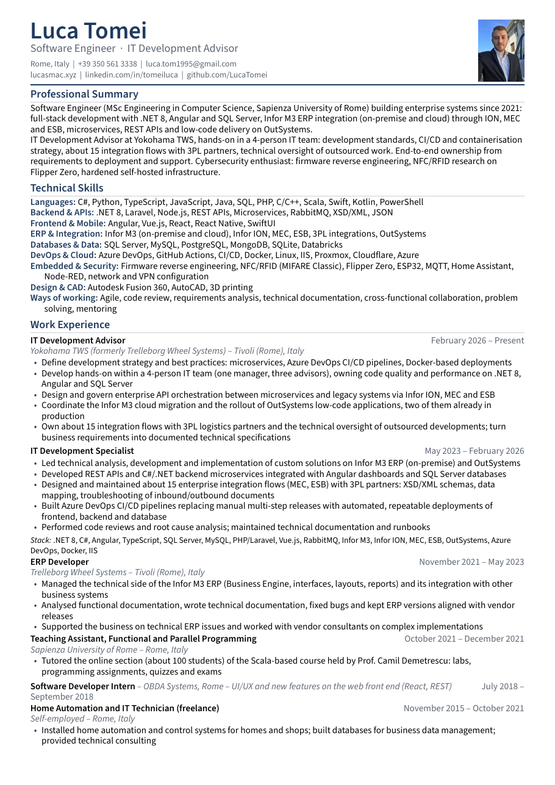
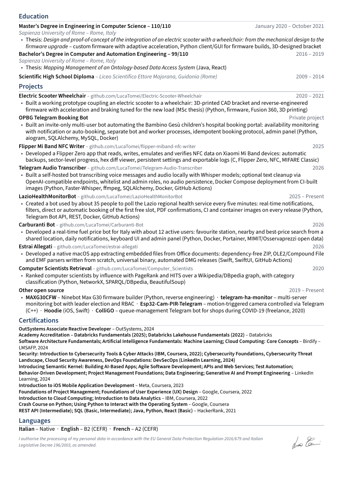

<div align="center">

# Luca Tomei — Curriculum Vitae

LaTeX sources of my CV, built and published automatically on every push.

[](https://github.com/LucaTomei/MyCV/actions/workflows/release.yml)
[](https://github.com/LucaTomei/MyCV/releases/tag/latest)
[](https://www.latex-project.org/)
[](LICENSE)

**[⬇ English PDF](https://github.com/LucaTomei/MyCV/releases/latest/download/Luca_Tomei_CV_EN.pdf)** ·
**[⬇ PDF italiano](https://github.com/LucaTomei/MyCV/releases/latest/download/Luca_Tomei_CV_IT.pdf)** ·
[English, no photo](https://github.com/LucaTomei/MyCV/releases/latest/download/Luca_Tomei_CV_EN_nophoto.pdf) ·
Word: [EN](https://github.com/LucaTomei/MyCV/releases/latest/download/Luca_Tomei_CV_EN.docx) / [IT](https://github.com/LucaTomei/MyCV/releases/latest/download/Luca_Tomei_CV_IT.docx) ·
[lucasmac.xyz](https://lucasmac.xyz)

<br>

<a href="https://github.com/LucaTomei/MyCV/releases/latest/download/Luca_Tomei_CV_EN.pdf"></a>
&nbsp;
<a href="https://github.com/LucaTomei/MyCV/releases/latest/download/Luca_Tomei_CV_EN.pdf"></a>

<sub>Italian version: <a href="dist/preview-it-1.png">page 1</a> · <a href="dist/preview-it-2.png">page 2</a></sub>

</div>

## Why a repository for a CV

- **One source of truth.** Both languages share a single template (`common/preamble.tex`); only the content files differ.
- **Always current.** A push to `main` rebuilds both PDFs, refreshes `dist/` and updates the rolling [`latest`](https://github.com/LucaTomei/MyCV/releases/tag/latest) release. My website links straight to those assets.
- **Parser-friendly by construction.** The template is designed for applicant tracking systems, and CI verifies it on every build.
- **Every format a portal may ask for.** PDF with and without photo, plus native Word files generated from the same sources.

## Designed for ATS parsers

Most job portals run the PDF through a résumé parser before a human sees it. The template avoids everything that breaks those parsers:

| Choice | Reason |
|---|---|
| Single column, A4, no header/footer | Multi-column layouts get read out of order; text in headers/footers is often dropped |
| Plain-text contact line (no icon fonts) | Icon glyphs turn into garbage characters in the extracted text |
| `Label: value` skill lines with real spaces | Labels laid out with boxes get glued to their values |
| T1 font encoding + `glyphtounicode` | Accented characters and ligatures extract as proper Unicode |
| Standard section names, `Month YYYY – Month YYYY` dates | These are what parsers pattern-match on |
| PDF metadata (Author, Title, Subject, Keywords, Language) | Used as fallback fields by many systems |

`scripts/check-cv.sh` extracts the text with `pdftotext` and fails the build if the page count exceeds two, the page is not A4, the metadata is empty, a contact detail or section heading is missing, or any accent/glyph came out broken.

`scripts/build-docx.py` walks the same LaTeX content and writes a native `.docx` (real headings, bullet lists and document properties) for portals that only accept Word files.

## Repository layout

```
CV-EN/main.tex         English content
CV-EN/nophoto.tex      English build without the photo
CV-IT/main.tex         Italian content
common/preamble.tex    Shared template (layout, macros, PDF metadata)
common/foto.jpg        Photo
common/firma.png       Signature
scripts/check-cv.sh    Parser checks run in CI (and by `make check`)
scripts/build-docx.py  Word export from the LaTeX content
dist/                  Latest PDFs, Word files and previews — written by CI, do not edit
archive/pre-2024/      Previous template (AltaCV), kept for reference
```

## Building locally

Requires a TeX distribution with `latexmk`, `poppler-utils` for the checks and `python-docx` for the Word export.

```bash
make            # PDFs (EN, IT, EN without photo) and Word files under build/
make check      # same parser checks as CI
make dist       # copy everything to dist/ with the public names
```

## Release pipeline

```
push to main ──▶ pdflatex (EN, IT, EN no photo) + Word export ──▶ parser checks ──▶ dist/ commit ──▶ release "latest"
```

The PDF date is pinned to the last commit that touched the sources (`SOURCE_DATE_EPOCH`), so rebuilding unchanged sources produces byte-identical files and no spurious commits.

## License

The template, scripts and workflow are released under the [MIT License](LICENSE). The CV content, photo and signature are personal and not licensed for reuse.
